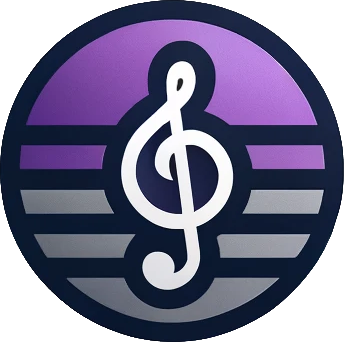

# BeatBoxBox

  

BeatBoxBox is a comprehensive music serving webserver that enables users to upload, download, and listen to music online. It offers a rich set of features for interacting with music through a web interface, supported by a robust backend.

## Features

### Playlists
Manage custom playlists to organize your favorite tracks.

### User Authentication
Secure login and registration for users.

### User Preferences Analysis & Suggestions
Leverage user data to recommend and customize music suggestions.

### Music Upload
Allow users to upload their own music files to the platform.

### Music Download
Enable users to download music for offline listening.

### Music Streaming
Stream music directly without the need to download.

### Music Search
Search functionality to find music by various criteria like artist, title, or album.

### Music Recommendation
Deliver music recommendations based on user behavior and preferences.

### Music Rating
Facilitate users to rate music, which influences recommendations.

## Technologies

### Backend
Golang based backend server that serves the frontend and handles the business logic.

### Frontend
Vue.js based frontend that interacts with the backend server.

## Getting Started

To get the project running locally:

1. Install the dependencies:
   - Docker
   - Docker Compose

2. Clone the repository (you can also download the repository as a zip file and extract it):
`git clone https://github.com/BoxBoxJason/BeatBoxBox.git`

3. Setup your TLS certificates (to use https):
   1. `cd BeatBoxBox`
   2. `mkdir secret`
   3. `openssl req -x509 -nodes -days 365 -newkey rsa:4096 -keyout secret/key.pem -out secret/cert.pem`

4. Select your environment variables:
   - Edit the `.env` file to set the environment variables for the project.

5. Build and run the project:
   1. `cd BeatBoxBox`
   2. For linux & mac users: `./quickstart.sh`
   3. For windows users (will never be tested so hope it works): `quickstart.ps1`

6. Access the web interface with your web browser at `https://localhost:3000`
